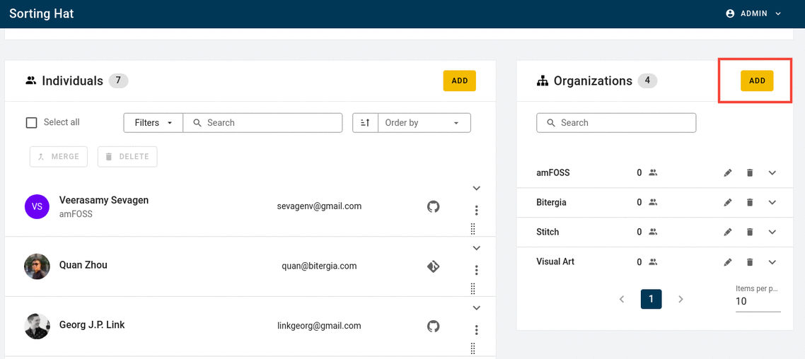
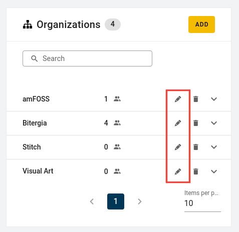

# Organisations

Organisations in Sortinghat refers to the potential affiliations that individuals may have (Bitergia, Accenture, Fujitsu etc...)

## How to add organisations

In order to add an organisation in SortingHat, see the <code>Organisations</code> table on the rightmost side of the interface.

1. Click on the "Add" button to open the "Add organisation" dialogue box
2. Fill in the name of the organisation (Bitergia) and the domain or domains (www.bitergia.com).
3. Save and it should be done !

## How to edit organisations

Organisation data consists of a name and domains. However only the domains are editable. You can either remove the exisiting domain or add new domains. In both cases, the process is pretty easy. Click on the edit icon to open up the Edit dialogue and press "Save" once done

