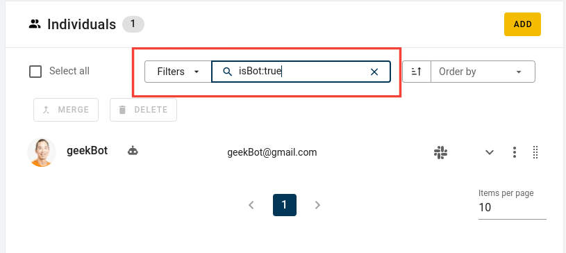
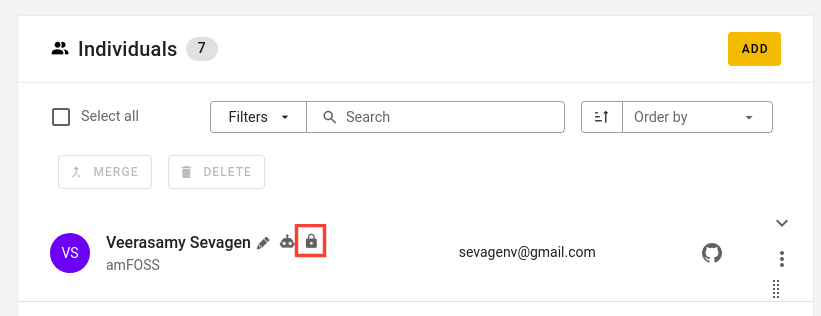
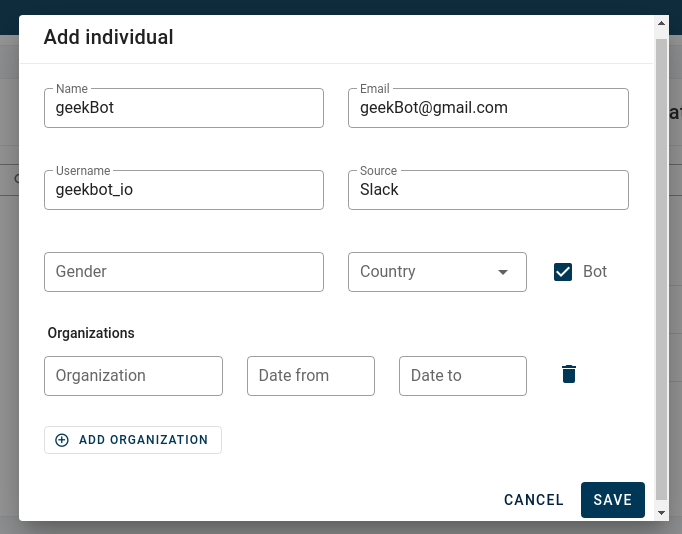

# What more can SortingHat do

- <strong>Easy profile filtering</strong> 
  Looking for a particular profile ? SortingHat provides several filters which can be used to filter through the lists of individuals to find the required one. You can filter the profiles according to the following filters. 

  - <code style="background-color: #FBE5E1; color: #C0341D; padding: 0 0.4rem; font-size:15px;">isBot</code>   Filter profiles marked as bots. For example `isBot: true` will return all profiles marked as bot and vice versa. 
     
  - <code style="background-color: #FBE5E1; color: #C0341D; padding: 0 0.4rem; font-size:15px;">isLocked</code>   Filter profiles marked as locked. For example `isLocked: true` will return all profiles marked as locked and vice versa 
  - <code style="background-color: #FBE5E1; color: #C0341D; padding: 0 0.4rem; font-size:15px;">country</code>   Filter using either country name or country code . For example `country: "United States of America` and `country: USA` return the same result. 
  - <code style="background-color: #FBE5E1; color: #C0341D; padding: 0 0.4rem; font-size:15px;">gender</code>   Filter profiles based on their gender. For example `gender: non binary` 
  - <code style="background-color: #FBE5E1; color: #C0341D; padding: 0 0.4rem; font-size:15px;">source</code>   Filter based on data source. For example `source: Github` 
  - <code style="background-color: #FBE5E1; color: #C0341D; padding: 0 0.4rem; font-size:15px;">enrollement</code>   Filter based on organisations. For example `enrollment: "Bitergia"` 
  - <code style="background-color: #FBE5E1; color: #C0341D; padding: 0 0.4rem; font-size:15px;">isEnrolled</code>   Filter based on enrollement status. For example `isEnrolled: true` will return all profiles currently enrolled at some organisation and vice versa 
  - <code style="background-color: #FBE5E1; color: #C0341D; padding: 0 0.4rem; font-size:15px;">enrollmentDate</code>  
    Filter profiles based on when they were affiliated to an organisation.  

    | Filter                                             | Explanation                                                                              |
    | -------------------------------------------------- | ---------------------------------------------------------------------------------------- |
    | <code>enrollmentDate:>YYYY-MM-DD</code>            | Matches individuals that were affiliated to an organization after the given date.        |
    | <code>enrollmentDate:>=YYYY-MM-DD</code>           | Matches individuals that were affiliated to an organization on or after the given date.  |
    | <code>enrollmentDate:&lt;YYYY-MM-DD</code>         | Matches individuals that were affiliated to an organization before the given ;date.      |
    | <code>enrollmentDate:<=YYYY-MM-DD</code>           | Matches individuals that were affiliated to an organization on or before the given date. |
    | <code>enrollmentDate:YYYY-MM-DD..YYYY-MM-DD</code> | Matches individuals that were affiliated to an organization between the given dates      |

  - <code style="background-color: #FBE5E1; color: #C0341D; padding: 0 0.4rem; font-size:15px;">lastUpdated</code>  
    Filter profiles based on when they were modified.  

    | Filter                                          | Explanation                                                       |
    | ----------------------------------------------- | ----------------------------------------------------------------- |
    | <code>lastUpdated:>YYYY-MM-DD</code>            | Matches individuals that were updated after the given date        |
    | <code>lastUpdated:>=YYYY-MM-DD</code>           | Matches individuals that were updated on or after the given date. |
    | <code>lastUpdated:&lt;YYYY-MM-DD</code>         | Matches individuals that were updated before the given date.      |
    | <code>lastUpdated:<=YYYY-MM-DD</code>           | Matches individuals that were updated on or before the given date |
    | <code>lastUpdated:YYYY-MM-DD..YYYY-MM-DD</code> | Matches individuals that were updated between the given dates.    |

     

- <strong>Lock a profile</strong> 
  SortingHat provides the ability to lock a profile. That is, no merge/delete/edit can be acccomplish with that particular profile. It is basically blacklisted from involving in any of the processes which can happen in SortingHat. In order to lock a profile, simply hover right next to the profile name and a bunch of icons should appear. Click on the lock icon to lock the profile.  
  Note: _Profile can be unlocked by clicking on the lock icon again_  

    

- <strong>Set profile as Bot</strong> 
  As we know, some identities can turned out to be bots. In order to remedy that, SortingHat provides the ability to mark profiles as Bot. The latter can be done either when creating a profile or after creating a profile. 

  - When creating a profile, you'll have the option to mark a profile as Bot. Simply check that option and Save.  
      
  - After creating a profile, hover right next to the profile's name and a set of icons will appear. Click on the bot icon to mark it as bot.  
      

- <strong>Order profiles</strong>
  SortingHat provides the ability to display the list of profiles in ascending or descending order based on three filters (Last Updated, Created data and Name)  
  

- <strong>Un-enroll an indivudual from an organisation</strong> 
  Simply go to the person's profile and in the `Organisations` section, click on Bin icon to remove that particular org from someone's profile. In the case, all of the affiliation need to be removed, click on the "Remove all" button in the Organisations section.
