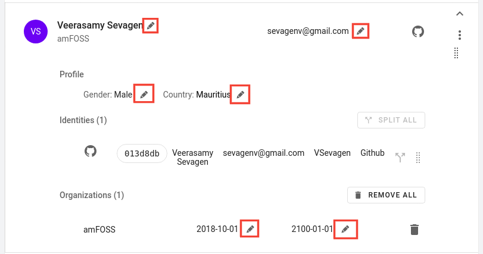

# How to edit profiles

Once a profile is created, it is possible to edit some of its information, however some information is set during the profile creation phase and cannot be edited.

A profile consists of two parts, <strong>identities</strong> and <strong>Organisations</strong> data.

- <strong>Profile</strong> information such as Name, Email, Gender and Country is editable. However <strong>Source is not editable.</strong>
- <strong>Identities</strong> are <strong>NOT editable</strong> unless they are split up. Once split up, each identity is a standalone profile so the above descriped field would be editable.
- <strong>Organisation</strong> data such as Date from and Date to are editable. Organisation data can also be removed as a whole.

Tip: _If you hover on any field in profile and the edit icon appears, that means the filed is edtable._

