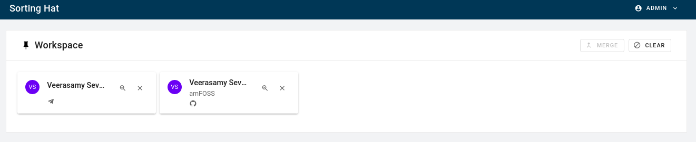

# SortingHat's new interface

As stated before, SortingHat's is currently being revamped into a service and as a result, its user-interface has been improved as well.

- <strong>Workspace</strong> is where you keep individuals on whom you want to perform some actions. This is in the case where you have numerous profile entries but need to perform some action on a few of them.

- <strong>Individuals</strong> is, as the name suggest, where all the individual's profiles are located. Information such as name, email, identities and affiliations can be found out from their respective profile.

- <strong>Organisation</strong> is the list of affiliations than an individual can have.

