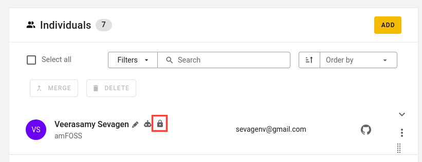

# Lock a profile

SortingHat provides the ability to lock a profile. That is, no merge/delete/edit can be acccomplish with that particular profile. It is basically blacklisted from involving in any of the processes which can happen in SortingHat. In order to lock a profile, simply hover right next to the profile name and a bunch of icons should appear. Click on the lock icon to lock the profile.  
Note: _Profile can be unlocked by clicking on the lock icon again_  

  
