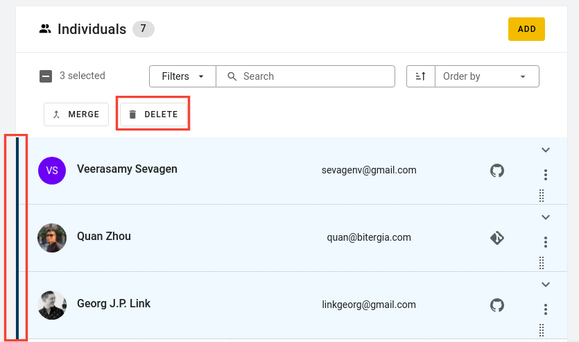

# How to remove a profile

Every profile in the <code>Indivduals</code> table will have a "More options" icon which opens up a tab with several options, including <strong>Delete profile</strong>. Clicking on "Delete profile" will open a pop-up where you'll have to confirm that you really want to delete this profile. If yes, press <strong>Confirm</strong>. This will remove the individual in question from SortingHat. 

 

In the case several profiles need to be removed, they can be selected and deleted in batches using the "Delete" button. To select a profile, click on the profile once. A blue strip will appear on the left side of the profile tab. That is the indicator that a profile is selected.

 
