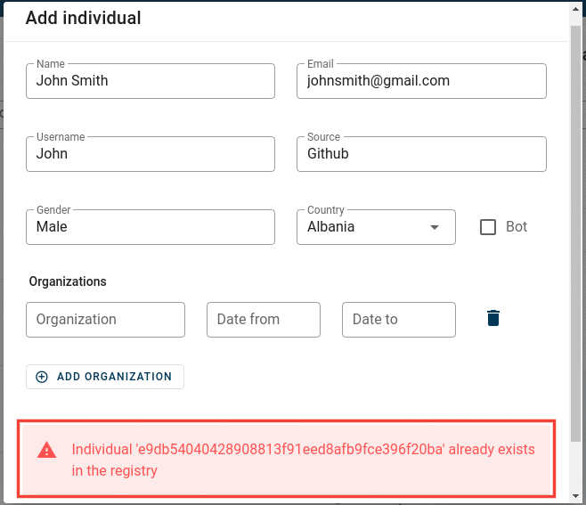
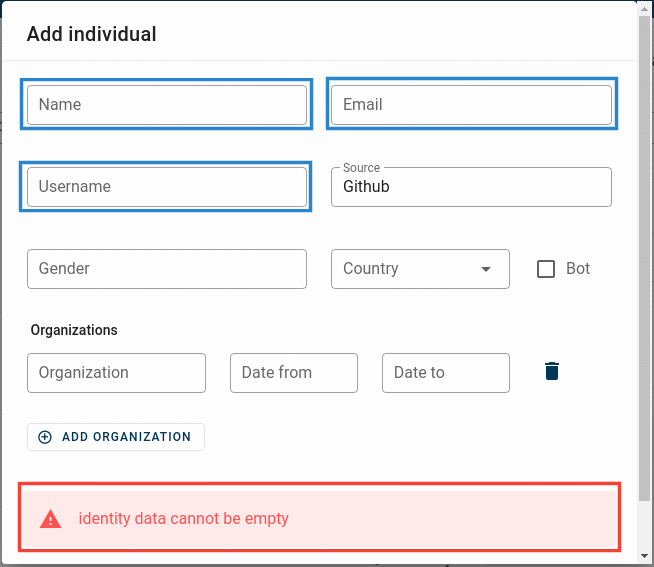
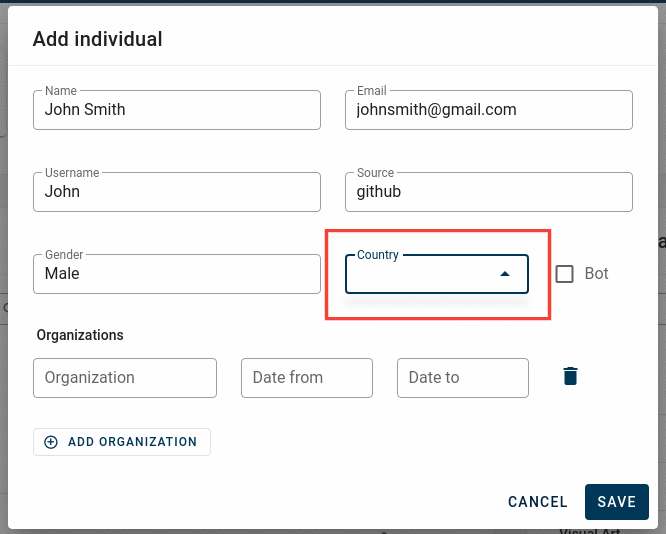

# Troubleshooting steps

### Login Issues


<!--  -->

This error is pretty straightforward. You have either mistyped your username and password or you have forgotten your credentials.
Usually that would not happen since SortingHat uses cookies to improve user experience. But in the case that you've logged out, here's how to regain access.

Assuming that you did not forget your username, you can use the following command to change your password.

```
(.venv)$ ./manage.py changepassword <user_name> --settings=config.settings.devel
```

In the case that you forgot your username as well, you can check out your database server(MySQL or MariaDB) and look into the `sortinghat_db` database. The `auth_user` table contains data pertaining to login credentials. The password is encryped but the username is readable. Once you've got hold of the username, follow the above step to change your password.

### Profile creation issues

<br>

- <strong>Organisation not found</strong><br><br>
  
  <!--  -->

The above issue arises when the organisation submitted does not exist in the `Organisation` table. "Bitergia" here is taken as an example.
In order to fix it, make sure to [add your organisation](https://vsevagen.github.io/grimoirelab-sortinghat/docs/sortinghat/add-org/) first, then [create the individuals profile](https://vsevagen.github.io/grimoirelab-sortinghat/docs/sortinghat/create-profile/).<br>

- <strong>Profile already exist</strong><br><br>
  
  <!--  -->
  <br>
  The above issue arises if a existing profile has the exact same information (Name, Email, Username, Source etc...) as the profile being created. The ID `013d8db4d7fba708448c146c8fb54f8dcb974ed1` refers to the unique identifier of a profile.

- <strong>Fields cannot be empty</strong><br><br>
  
  <!--  -->
  <br>
  The above issue is pretty staightforward. In order to create a profile, a minimum amount of information is required which includes, primarily the <code>Source</code> and any other identity related info (`Name` or `Email` or `Username`).<br><br>

- <strong>Country option not working</strong><br><br>
  It may happen that the option to choose a country does not work in SortingHat. That is you enter the necessary details but it is not saved. The first indication that something went wrong would be that upon clicking the "Country" tab when creating a profile, the countries popover does not appear ( A popover with all the countries should appear and you can choose the appropriate country from it )<br><br>
  
  <br><br>

  The reason for this issue might be that you forgot to run `countries.json` fixture. Running the following line should fix it.

  ```
  (.venv)$ ./manage.py loaddata sortinghat/core/fixtures/countries.json --settings=config.settings.devel
  ```

  <br>

  
